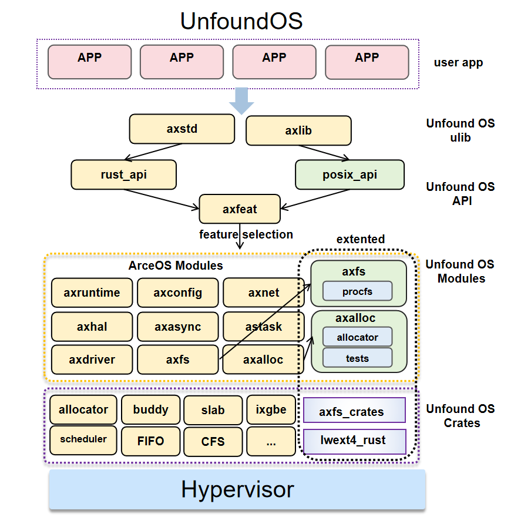

# Unfound

基于 ArceOS 使用 Rust 开发的操作系统，具备良好的模块化设计与用户态支持能力。

## 项目简介

本项目是基于 ArceOS 开发的操作系统，采用 Rust 语言实现。系统继承了 ArceOS 的模块化架构设计，并在进程管理、内存管理、文件系统方面进行了重要改进，主要包括：

内存管理工作（本分支重点）：
- 多分配器框架（Multi-Allocator Framework）
  - 以 PageAllocator trait 抽象接口统一分配器，实现 Buddy/Bitmap/Hybrid 等策略
  - 支持运行时切换与对比测试，便于逐步迁移与回归验证

- 实验环境与数据具象化
  - 可配置内存池大小、负载模型、长时运行（1h/6h/24h）等实验维度
  - 统一采集成功率、延迟分布（P50/P99）、吞吐量、外/内部碎片率等指标
  - 生成标准化报告与分配器对比视图，便于深度理解分配策略以及问题定位与优化迭代

- 测试模块
  - 基础性能、碎片、稳定性、时间维度、内核 no_std 适配测试套件
  - 同时支持 CLI 与程序化调用，提供 small/medium/large 预设与自定义配置

- 可扩展性
  - 模块化测试框架与 feature gating，便于新增/替换分配策略
  - 通过 trait 接口快速接入新分配器，统计接口与日志强度可调


文件系统（fs分支）：
- 统一文件接口：为不同文件系统类型提供统一的抽象接口
- 动态挂载机制：支持运行时动态挂载和卸载文件系统


## 支持的目标平台
- 架构：x86_64、aarch64、riscv64、loongarch64
- 默认平台：QEMU pc-q35（x86_64）、QEMU virt（aarch64/riscv64/loongarch64）

## 项目目录结构(本分支)
- modules：内核组件（内存、调度、驱动、网络、文件系统、日志等）
  - axalloc：内存分配器框架与测试（PageAllocator、Buddy/Bitmap/Hybrid、tests）
- api：应用接口（axfeat、arceos_api、arceos_posix_api）
- ulib：用户态库（axstd、axlibc）
- examples：子系统示例与冒烟测试
- configs：平台配置
- scripts、tools：构建与 QEMU 运行脚本
- doc：设计文档与图表

## 快速开始

### 前置依赖
- 安装 rust-toolchain.toml 指定的工具链（rustup）
- 安装辅助工具：
	```bash
	cargo install cargo-binutils axconfig-gen cargo-axplat
	```
- 安装 QEMU：
	```bash
	# Ubuntu/Debian
	sudo apt-get install qemu-system
	# macOS
	brew install qemu
	```
- 可选（C 应用）：`sudo apt install libclang-dev`，并安装 aarch64/riscv64/x86_64/loongarch64 的 musl 交叉工具链，将其 bin 目录加入 PATH。

### 运行内存分配器测试
```bash
# 进入分配器测试模块目录
cd modules/axalloc
# 运行 Buddy 分配器的全量测试套件
cargo run --bin allocator_test --features "buddy std" all
# 更多特性或对比运行请参考测试文档
```
详细说明请参见：modules/axalloc/src/tests/README.md

## 开源协议
与上游一致：GPL-3.0-or-later、Apache-2.0、MulanPSL-2.0。